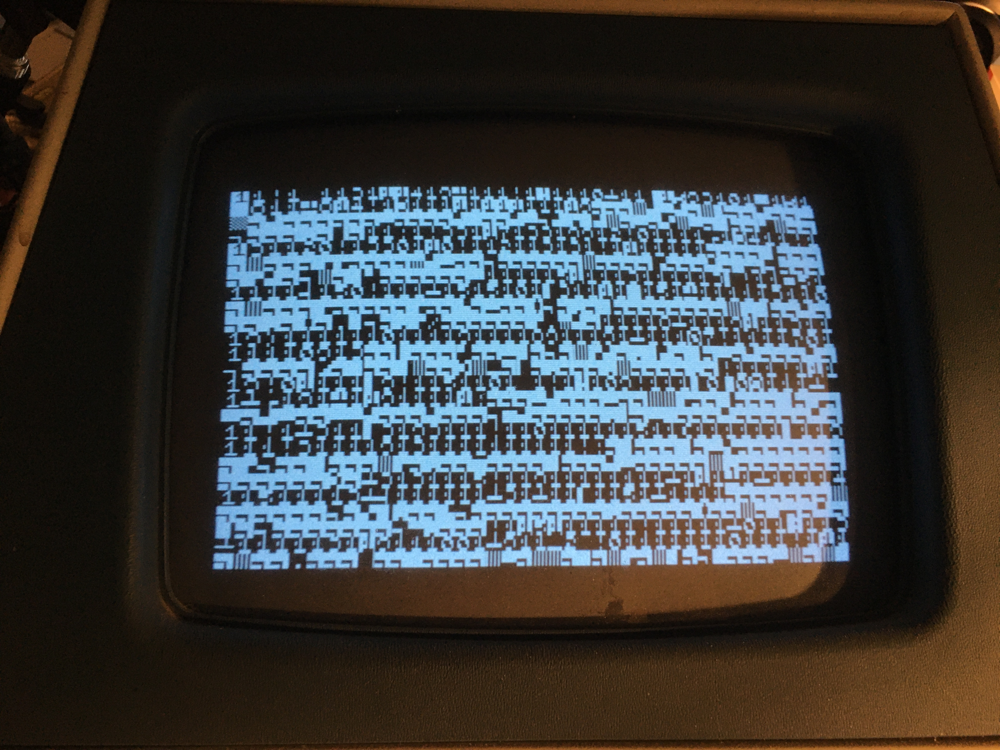
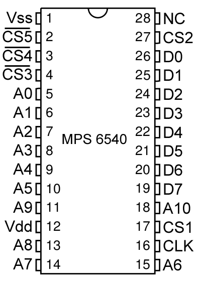
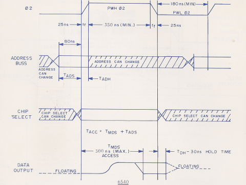
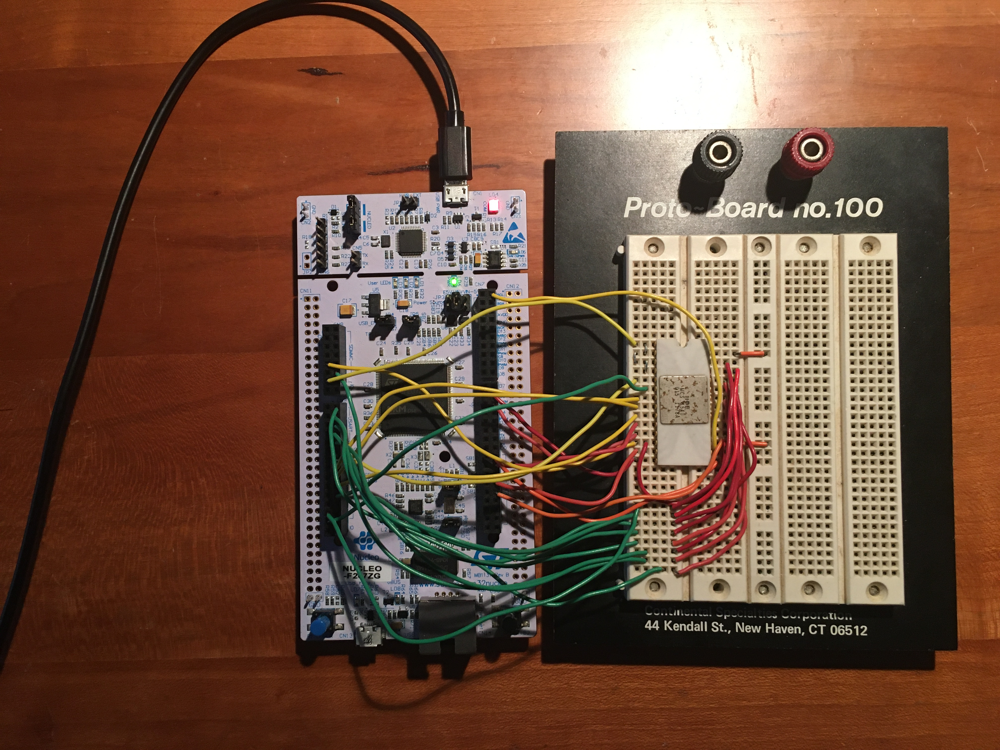
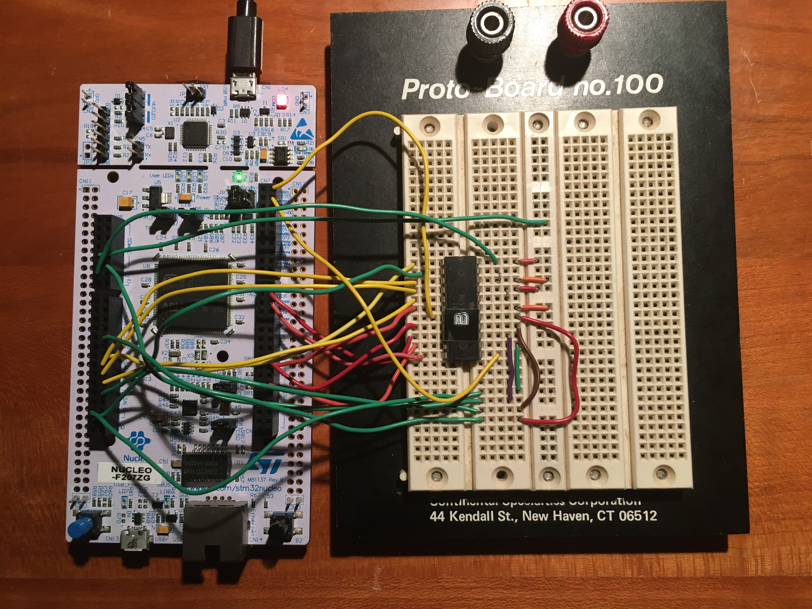
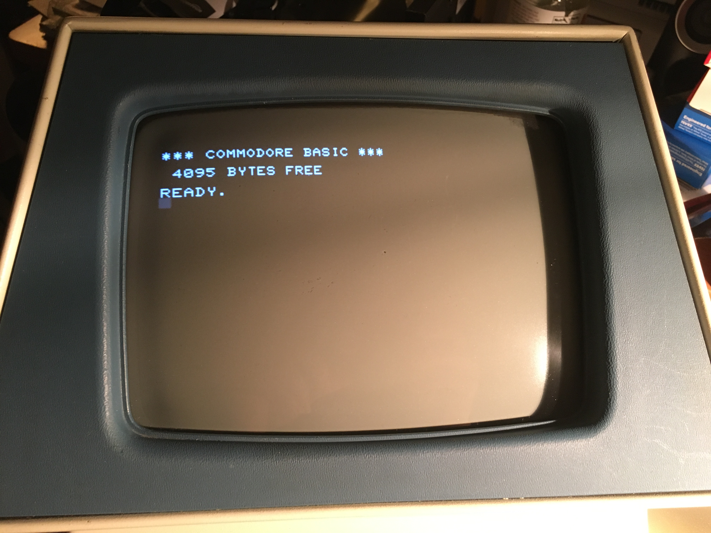
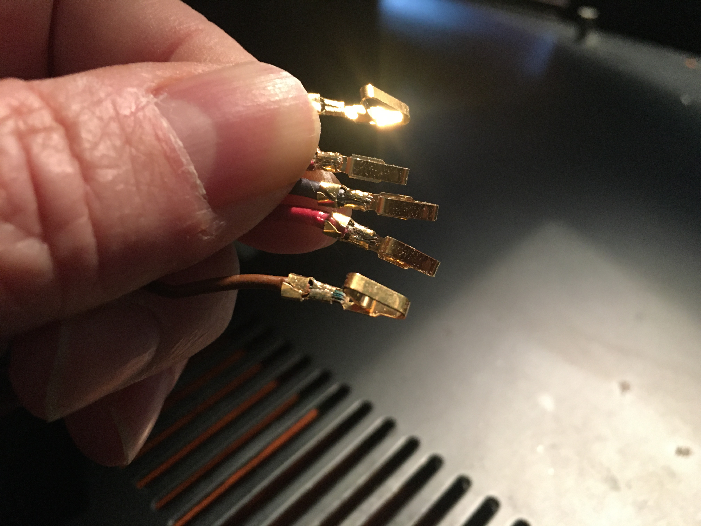
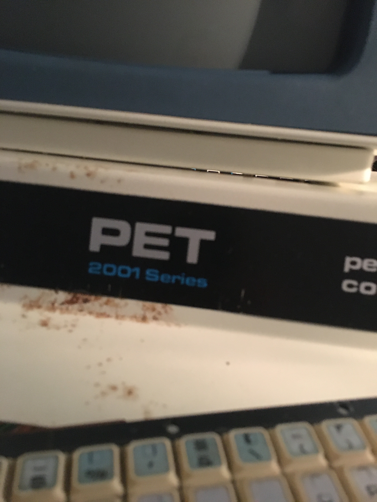
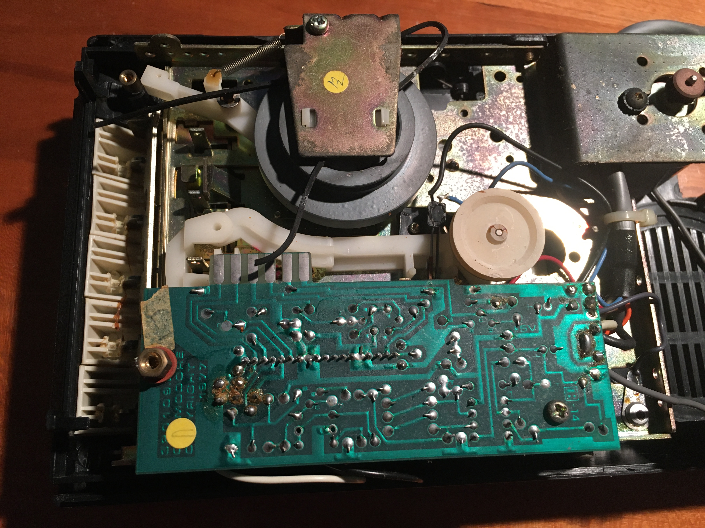

% PET restoration
% E. Beroset
% 18 January 2020

# Introduction
I've owned my Commodore PET since 1978.  For about the last 25 years, the PET hasn't worked due to one or more problems. In 2019, I diagnosed and fixed a problem with the power supply (faulty filter capacitor), but there are still other issues.  This document is a record of my attempts to fix up the old PET.

## Symptom
The current symptom is that the screen is all scrambled.  That is, instead of reporting "7167 BYTES FREE" as a healthy PET would, I get a scrambled screen as shown below in Figure 1. 



To rectify this problem, I first tried moving RAM chips around.  I have the 18 6550 RAM chips (16 for main memory and 2 for video memory) labelled as A through S (omitting "O" because it looks too much like a zero).  It turns out that only 6 chips need to be installed in the machine for it to boot.  The two video RAM chips and only 4 of the memory chips in locations I1, J1, I2 and J2.  Initially,  the chips were I1 = A, J1 = B, I2 = C, J2 = D, C3 = E, C4 = F.  Changing to S,G,J,K,L,M produced a nearly identical display, suggesting that the problem lies elsewhere.  I am starting to suspect ROMs.

## ROM diagnostics
I recall that when the PET boots normally, it turns off the cassette motor within about 1 second.  That is still happening, so I am starting to wonder about perhaps the character ROM or other ROMs being bad.  Figuring out which one will need a bit of sleuthing.  I first tried to swap the character ROM (010) with H1 (011).  As expected, the initial random screen no longer had any identifiable characters, suggesting that the character ROM is not completely bad.  I next replaced char ROM (010) and removed H1 (011) and H2 (013) and the result was essentially the same as when they are present.  While not definitive, this suggests that the problem may be in the higher ROMs.  I next removed H6 and H5 and the problem was nearly identical.  When I also removed H3, the cassette motor no longer turns off but the display is nearly identical.  Finally, I removed all ROMs and the display is about the same, but the cassette motor stays on.  From left to right looking from the front of the PET, the ROMs are as shown in the table below.  Note that the range of E800 to EFFF is "missing" because that range is mapped to IO.  Specifically, PIA 1 is E810 to E81F, PIA 2 is E820 to E82F, the VIA is E840 to E84F and on models equipped with it (this one is not) the CRTC is mapped to E880 to E88F.

| Pos | ROM | Start | End  |
|-----|-----|-------|------|
| H7 | 018 | F800 | FFFF |
| H6 | 014 | D800 | DFFF |
| H5 | 012 | C800 | CFFF |
| H4 | 016 | F000 | F7FF |
| H3 | 015 | E000 | E7FF |
| H2 | 013 | D000 | D7FF |
| H1 | 011 | C000 | C7FF |

The 6540 ROM pinout is shown in Figure 2.  To verify the ROMs, I will use an Arduino-compatible development board I have available (the Nucleo F207ZG from ST Microelectronics) and read the contents of the ROM and stream to a serial port.  The sequence for addressing the ROM is as follows:

 1. Set 02 low
 2. Set Chip Select (CS1, CS2 to +5V, CS3, CS4, CS5 to GND)
 3. Set Address lines (A0 through A10)
 4. Allow at least 80ns to settle address lines
 5. Set 02 high
 6. Keep high for min 350ns (addr may change during this time)
 7. Read D0-D7
 8. Set 02 low

 See the timing diagram in Figure 3. 






### ROM tester
I'm using my Nucleo F207ZG board to do ROM testing.  Due to the fact that not all pins are easy to get to, I'm going to use PortE 2-12 for the address lines A0-A10 and PortD 0-7 for the D0-D7 lines.  All chip selects will be hardwired and the 02 (clock) line will be PB8.  Since it's a 300ns chip, I might need to add some delay.  I will use a 1us delay, which should be more than enough to allow me to read the contents of the ROM.  The ROM will be powered from +5VDC, but will be controlled via I/O at 3.3V, since that's what's used for the development board I'm using.  This works because the old TTL stuff only needed +2.0V or greater for `1`.  All of the ports on my development board are 5V tolerant as long as the pull-up and pull-down resistors are disabled.


|  Nucleo board | | |  6540 ROM  |
|----|-----|------|------|-----|
| CN | Pin | Desc | Desc | pin |
|----|-----|------|------|-----|
|  9 |  14 | PE2  |  A0  |  5  |
|  9 |  22 | PE3  |  A1  |  6  |
|  9 |  16 | PE4  |  A2  |  7  |
|  9 |  18 | PE5  |  A3  |  8  |
|  9 |  20 | PE6  |  A4  |  9  |
| 10 |  20 | PE7  |  A5  | 10  |
| 10 |  18 | PE8  |  A6  | 15  |
| 10 |   4 | PE9  |  A7  | 14  |
| 10 |  24 | PE10 |  A8  | 13  |
| 10 |   6 | PE11 |  A9  | 11  |
| 10 |  26 | PE12 |  A10 | 18  |
|  9 |  25 | PD0  |  D0  | 26  |
|  9 |  27 | PD1  |  D1  | 25  |
|  8 |  12 | PD2  |  D2  | 24  |
|  9 |  10 | PD3  |  D3  | 23  |
|  9 |   8 | PD4  |  D4  | 22  |
|  9 |   6 | PD5  |  D5  | 21  |
|  9 |   4 | PD6  |  D6  | 20  |
|  9 |   2 | PD7  |  D7  | 19  |
|  7 |   2 | PB8  |  CLK | 16  |
|  8 |   9 | +5V  |  Vdd | 12  |
|  8 |   9 | +5V  |  CS1 | 17  |
|  8 |   9 | +5V  |  CS2 | 27  |
|  8 |  13 | GND  |  Vss |  1  |
|  8 |  13 | GND  | #CS3 |  4  |
|  8 |  13 | GND  | #CS4 |  3  |
|  8 |  13 | GND  | #CS5 |  2  |

### ROM reading software for Nucleo board

```
#include "mbed.h"

//------------------------------------
// 115200 baud, 8-bit data, no parity
//------------------------------------

Serial pc(SERIAL_TX, SERIAL_RX, 115200);

DigitalOut myled(LED1);
DigitalOut blue(LED2);
DigitalIn button(BUTTON1);
DigitalOut clock02(PB_8);

// 0000 0000 1111 1111
PortIn  data(PortD, 0x00ff);  // PD7 to PD0

// 0001 1111 1111 1100
PortOut addr(PortE, 0x1ffc);  // PE12 to PE2

int getROM(int address) {
    clock02 = 0;
    int val = address << 2;
    addr.write(val);
    // pause if needed
    wait_us(1);
    clock02 = 1;
    // pause if needed
    wait_us(1);
    int mydata = data.read();
    clock02 = 0;
    return mydata;
}

int main()
{
    const int linelen = 16;
    while (1) {
        if (button) {
            myled = 1;
            for (int myaddr = 0; myaddr < 2048; myaddr += linelen) {
                pc.printf("%4.4x:", myaddr);
                for (int i=0; i < linelen; ++i) {
                    int d = getROM(myaddr+i);
                    pc.printf(" %2.2x", d);
                }
                pc.printf("\n");
            }
            myled = 0;
        }
    }
}
```

The actual rig is shown in Figure 4 with one of the ROMs under test.



### ROM testing results
The ROM test showed problems with two ROMs.  The 012 ROM (C800-CFFF) and the 010 ROM (character generator).  The symptoms were slightly different for each.  For the 012 ROM, most of the contents were intact but some of the bytes were 0xff.  The bytes were always odd addresses starting at 0x41, 0x43, 0x45, 0x47, 0x49, 0x4b, 0x4d, 0x4f and 0x51 and then every 0x80 bytes after those.  For the 010 ROM, the problem was that the high half of the ROM was a copy of the low half as though the A10 address line were stuck low.  While this test discovered problems with 2 ROMs, there are a number of aspects not tested, including whether all of the CS lines actually work and whether the ROM is too slow (the Nucleo program inserts a 1us pause, while the real timing spec is 350ns).  Still, this was fruitful and I may devise a means by which a more common part could be substituted.

## RAM testing
The 6550 SRAM chips are no longer made, but 2114 chips are still available.  They're not quite pin compatible but it's possible to make an adapter and I might actually have some 2114 chips somewhere.  The pinout is shown in Figure 5.


The table below is the circuit I'll use to test the RAM chips.  The built circuit is shown below as Figure 6.

|  Nucleo board |||  6550 RAM  |
|----|-----|------|------|-----|
| CN | Pin | Desc | Desc | pin |
|----|-----|------|------|-----|
|  9 |  14 | PE2  |  A0  |  1  |
|  9 |  22 | PE3  |  A1  |  2  |
|  9 |  16 | PE4  |  A2  |  3  |
|  9 |  18 | PE5  |  A3  |  4  |
|  9 |  20 | PE6  |  A4  |  5  |
| 10 |  20 | PE7  |  A5  |  6  |
|  7 |   2 | PB8  |  CLK |  7  |
| 10 |  18 | PE8  |  A6  |  8  |
| 10 |   4 | PE9  |  A7  |  9  |
| 10 |  24 | PE10 |  A8  | 10  |
| 10 |   6 | PE11 |  A9  | 11  |
|  7 |   4 | PB9  |  R/W | 12  |
|  9 |  25 | PD0  |  DB0 | 13  |
|  9 |  27 | PD1  |  DB1 | 14  |
|  8 |  12 | PD2  |  DB2 | 15  |
|  9 |  10 | PD3  |  DB3 | 16  |
|  8 |   9 | +5V  |  Vdd | 17  |
|  8 |  13 | GND  | #CS4 | 18  |
|  8 |  13 | GND  | #CS3 | 19  |
|  8 |   9 | +5V  |  CS2 | 20  |
|  8 |   9 | +5V  |  CS1 | 21  |
|  8 |  13 | GND  |  Vss | 22  |



### Test algorithm
There are a number of tests that could be used, but we can start with the obvious and quick ones and refine those later if needed.  As with the ROM testing, I'm not planning on testing the CS lines or the timing, but only the most basic function of a static RAM -- does it remember what it's asked to?  To that end, I'll use a simple test regimen using the following patterns:

 1. all zeroes
 2. all ones
 3. 0101 pattern
 4. 1010 pattern

### RAM test program

```
#include "mbed.h"

//------------------------------------
// 115200 baud, 8-bit data, no parity
//------------------------------------

Serial pc(SERIAL_TX, SERIAL_RX, 115200);

DigitalOut myled(LED1);
DigitalOut blue(LED2);
DigitalOut red(LED3);
DigitalIn button(BUTTON1);
DigitalOut clock02(PB_8);
DigitalOut reader(PB_9);

// 0000 0000 0000 1111
PortInOut  data(PortD, 0x000f);  // PD3 to PD0

// 0000 1111 1111 1100
PortOut addr(PortE, 0x0ffc);  // PE11 to PE2

int getRAM(int address) {
    clock02 = 0;
    reader = 1;
    data.input();
    int val = address << 2;
    addr.write(val);
    // pause if needed
    wait_us(1);
    clock02 = 1;
    // pause if needed
    wait_us(1);
    int mydata = data.read();
    clock02 = 0;
    return mydata;
}

void putRAM(int address, int nybble) {
    clock02 = 0;
    reader = 0;
    data.output();
    int val = address << 2;
    addr.write(val);
    data.write(nybble);
    // pause if needed
    wait_us(1);
    clock02 = 1;
    // pause if needed
    wait_us(1);
    clock02 = 0;
    data.input();
    reader = 1;
}

void fillRAM(int nybble) {
    for (int myaddr = 0; myaddr < 1024; ++myaddr) { 
        putRAM(myaddr, nybble);
    }
}

int verifyRAM(int nybble) {
    int errors = 0;
    for (int myaddr = 0; myaddr < 1024; ++myaddr) { 
        int got = getRAM(myaddr);
        if (got != nybble) {
            if (!errors) {
                pc.printf("Error at %4.4x: wanted %2.2x got %2.2x\n", myaddr, nybble, got);
            }
            ++errors;
        }
    }
    return errors;
}

int checkRAM(int value)
{
    int ok = 1;
    myled = 1;
    fillRAM(value);
    myled = 0;
    int errors = verifyRAM(value);
    if (!errors) {
        pc.printf("Verified %2.2x\n", value);
    } else {
        pc.printf("ERRORS (%d) with %2.2x\n", errors, value);
        ok = 0;
    }
    return ok;
}

int main()
{
    data.mode(PullNone);
    while (1) {
        if (button) {
            blue = 0;
            red = 0;
            int ok = checkRAM(0x0);
            ok &= checkRAM(0xf);
            ok &= checkRAM(0x5);
            ok &= checkRAM(0xA);
            if (ok) {
                blue = 1;
                red = 0;
            } else {
                blue = 0;
                red = 1;
            }
        }
    }
}
```

### RAM test results
As described above, I labeled the 6550 chips A through S (omitting the letter 'O' because it looks too much like a zero) and tested.  Only the failing chips are detailed here:

#### B
```
Verified 00
Error at 0000: wanted 0f got 0b
ERRORS (1024) with 0f
Error at 0000: wanted 05 got 01
ERRORS (1024) with 05
Verified 0a
```

#### I

```
Error at 0001: wanted 00 got 0b
ERRORS (911) with 00
Error at 0001: wanted 0f got 0b
ERRORS (955) with 0f
Error at 0001: wanted 05 got 0b
ERRORS (966) with 05
Error at 0001: wanted 0a got 09
ERRORS (850) with 0a
```

#### S
```
Error at 0000: wanted 00 got 07
ERRORS (1024) with 00
Error at 0000: wanted 0f got 07
ERRORS (1024) with 0f
Error at 0000: wanted 05 got 07
ERRORS (1024) with 05
Error at 0000: wanted 0a got 07
ERRORS (1024) with 0a
```

Since these are 1K x 4 bit RAM, B and S clearly have some stuck bits.  In particular, B seems to have DB2 stuck at 0 for all addresses, and S has all memory stuck at 0x7.  Chip I apparently has something of a soft error in that it doesn't show all 1024 bytes bad, but the vast majority of them with 0xb or 0x9 as the content.  It might be interesting at some point to decap these and see if it's possible to pinpoint (and maybe even fix?) the precise error on the die.

## Preliminary Results
I have ordered 4 new 6550 chips (new old stock) from a guy on Ebay and have also ordered a board that sits between the 6502 and the socket and effectively replaces the stock ROM and RAM with modern-ish replacements.  I think I will probably wait until I receive that to complete the restoration.

### Character ROM replacement
The character ROM can't be supplemented with the board mentioned above, so other means will be necessary.  I found some 2732s in my junk drawer and might also be able to find a 2716 or two, so either of those is a possible replacement.  A table of pinout equivalents is shown below, and the 24-pin 2732 maps nicely to the 28-pin 6540 except for one issue - the sense of the clock is inverted.  That is, while `CLK` (02) is high for a read of the 6540, `#G` must be low for a read of a 2732A so minimally, we'll need an inverter.  The typical way to do this, however, is to use a 74LS138 (5-line to 8-line decoder) to decode all address lines.  The simple way to do this is to connect CS1 to A, CS2 to B, #CS3 to C, #CS4 to G2A, #CS5 to G2B and then use the output Y3 to drive #G (pin 20) on the 2732.


| 2732A   | | 6540       || 74LS138    |
|-----|------|-----|------|-----|------|
| pin | name | pin | name | pin | name |
|-----|------|-----|------|-----|------|
|  12 |  Vss |   1 |  Vss |   8 |  GND |
|     |      |   2 | #CS5 |   5 | #G2B |
|     |      |   3 | #CS4 |   4 | #G2A |
|     |      |   4 | #CS3 |   3 |    C |
|   8 |   A0 |   5 |   A0 |     |      |
|   7 |   A1 |   6 |   A1 |     |      |
|   6 |   A2 |   7 |   A2 |     |      |
|   5 |   A3 |   8 |   A3 |     |      |
|   4 |   A4 |   9 |   A4 |     |      |
|   3 |   A5 |  10 |   A5 |     |      |
|  22 |   A9 |  11 |   A9 |     |      |
|  24 |  Vcc |  12 |  Vdd |     |      |
|  23 |   A8 |  13 |   A8 |     |      |
|   1 |   A7 |  14 |   A7 |     |      |
|   2 |   A6 |  15 |   A6 |     |      |
|     |      |  16 |  CLK |   6 |   G1 |
|     |      |  17 |  CS1 |   1 |    A |
|  19 |  A10 |  18 |  A10 |     |      |
|  17 |   D7 |  19 |   D7 |     |      |
|  16 |   D6 |  20 |   D6 |     |      |
|  15 |   D5 |  21 |   D5 |     |      |
|  14 |   D4 |  22 |   D4 |     |      |
|  13 |   D3 |  23 |   D3 |     |      |
|  11 |   D2 |  24 |   D2 |     |      |
|  10 |   D1 |  25 |   D1 |     |      |
|   9 |   D0 |  26 |   D0 |     |      |
|     |      |  27 |  CS2 |   2 |    B |
|     |      |  28 |   NC |     |      |
|  18 |   #E |   1 |  Vss |   8 |  GND |
|  20 |   #G |   1 |  Vss |   8 |  GND |
|  21 |  A11 |   1 |  Vss |   8 |  GND |

### Programming a 2764A
Since I was able to locate some 2764A chips, so I'll use that.  Since it is a 8K x 8 device and the original 6540 is a 2K x 8 device, I'll have room for four copies.  What I think I will do is program the US character set in the top half and the German character set in the bottom half so that I can switch by just changing a jumper that would go to the A12 line of the EEPROM.  Pointless, sure, but *something* needs be put in there, so it may as well be something marginally useful.  My old EEPROM programmer is a Jameco PC card that is currently installed in an old computer.  Unfortunately, everything old enough to have a ISA slot is also too old to run any recent version of Linux, and I can't find the DOS-based software anyway, so I think the least effort path is simply creating a new circuit to do the job.

### The approach
Since I have a few 2764s, including at least one I know is not erased, I'll first modify the 6540 ROM reader above to create a 2764 reader.  Next will be to apply an external +12.5V Vpp and program and verify the ROM.


|  Nucleo board |||  2764 ROM  |
|----|-----|------|------|-----|
| CN | Pin | Desc | Desc | pin |
|----|-----|------|------|-----|
|  9 |  14 | PE2  |  A0  | 10  |
|  9 |  22 | PE3  |  A1  |  9  |
|  9 |  16 | PE4  |  A2  |  8  |
|  9 |  18 | PE5  |  A3  |  7  |
|  9 |  20 | PE6  |  A4  |  6  |
| 10 |  20 | PE7  |  A5  |  5  |
| 10 |  18 | PE8  |  A6  |  4  |
| 10 |   4 | PE9  |  A7  |  3  |
| 10 |  24 | PE10 |  A8  | 25  |
| 10 |   6 | PE11 |  A9  | 24  |
| 10 |  26 | PE12 |  A10 | 21  |
| 10 |  10 | PE13 |  A11 | 23  |
| 10 |  28 | PE14 |  A12 |  2  |
|  9 |  25 | PD0  |  D0  | 11  |
|  9 |  27 | PD1  |  D1  | 12  |
|  8 |  12 | PD2  |  D2  | 13  |
|  9 |  10 | PD3  |  D3  | 15  |
|  9 |   8 | PD4  |  D4  | 16  |
|  9 |   6 | PD5  |  D5  | 17  |
|  9 |   4 | PD6  |  D6  | 18  |
|  9 |   2 | PD7  |  D7  | 19  |
|  8 |   9 | +5V  |  Vcc | 28  |
|  8 |  13 | GND  |  Vss | 14  |
|  7 |   2 | PB8  |   #G | 22  |
|  7 |   4 | PB9  |   #E | 20  |
|  7 |   3 | PB15 |   #P | 27  |

First, we'll write a program to dump the ROM contents.  I might make this a bit smarter than the previous version and have a DDT-style interface to allow for a little better user interface.  Also, in anticipation of needing to have the contents of the ROM entirely in the memory of the ARM processor before programming, I'll allocate an 8K buffer for it and use that.  

#### Commands
I think that the commands I want to implement should be as shown in the table below:

| command | letter | arguments  |
|---------|--------|------------|
| compare |    c   | range addr |
| dump    |    d   | range      |
| fill    |    f   | range list |
| load    |    l   | addr       |
| move    |    m   | range addr |
| search  |    s   | range list |
| crc     |    x   | range      |

Since there are actually two address ranges (buffer and ROM), I'll use an `r` prefix for any address or range to indicate the ROM.  For the dump output format, the addresses will all be 6-digit hex followed by a colon and up to 16 pairs of hex digits to show the content.  I may as well also put the ASCII equivalents to the right.  So for example, the command:

    d r1fe0 1ffe

Might result in this output:

```
001fe0: 30 0a 46 c1 a0 03 00 01 06 00 f2 d5 15 22 41 d3  0.F.........."A.
001ff0: 1a e9 00 00 00 00 49 45 4e 44 ae 42 60 82        ......IEND.B`.
```

Note that a *range* is a pair of addresses and that if it's a ROM address range the `r` prefix need only appear for the first number in the range and is implicit in the second.

#### Redesign
In making this code a little simpler, it seems that all that's actually needed is a subset of the commands listed above.  Specifically the following commands are implemented:

| command | letter | action                       |
|---------|--------|------------------------------|
| crc     |    c   | calculate CRC of buffer      |
| dump    |    d   | dump buffer to stdout        |
| file    |    f   | load file into RAM           |
| read    |    r   | copy ROM to buffer           |
| program |    p   | program ROM with buffer data |
| version |    v   | print version of ROMtool     |

I've simplified by eliminating the arguments and by relying on a buffer to do most operations.  The CRC is the same algorithm as is used for the POSIX [`cksum`](https://pubs.opengroup.org/onlinepubs/9699919799/utilities/cksum.html), so it uses the polynomial $$G(x)= x^{32}+x^{26}+x^{23}+x^{22}+x^{16}+x^{12}+x^{11}+x^{10}+x^{8}+x^{7}+x^{5}+x^{4}+x^{2}+ x+1$$ and appends the length of the buffer, in little-endian format using the fewest possible bytes.  That is, if the length is 0x00001234 bytes, then 0x34, 0x12 would be appended to the buffer for CRC calculation.  The seed value is 0 and the result is complemented.  

For this circuit, I used an external +12.5V power supply connected to Vpp (pin 1) to program the EPROMs.  Some EPROMs need +21V, but the power supply I have handy only goes to +15V, but fortunately, I was able to find two Hitachi 2764 devices that only need +12.5V for programming.

### Result
Putting in most of the RAM except the three faulty ones (B, I, S) and a spare (R) and installing the replacement ROMs in adapters, the machine doesn't seem to boot at all.  It has an initial random screen (which is normal) and then clears the screen (which is normal) but then proceeds no further.  It should, instead, enumerate the RAM and show a message, but this does not happen.  Today, my ROM/RAM replacement board should arrive and so I'll do further troubleshooting then.

After I received my board, I determined that I may have more bad RAM than I thought.  In addition to B, I and S, it appears that A, C and possibly G are bad.  The machine boots and runs with R, F in the video RAM and K, L, M, N, P, Q, H, J, D, E installed.  It reports 4095 bytes free which is consistent with 5K installed.  Since it reports 7167 bytes free with 8K installed we calculate $8*1024 - 7167 = 1025$ and $5*1024 - 4095 = 1025$.   Successful boot screen is shown in Figure 7 below.



## Power supply
After the machine is on for a few seconds, I noticed a lot of "snow" on the screen and can hear the transformer buzzing.  Further investigating, the J8 Molex power connector becomes quite hot on one side, so I took it apart and discovered that the pin 1 connection was both corroded and also had some of the stranded copper wire strands broken, both leading to high resistance.  To fix that, I've ordered a replacement connector and pins, this time upgrading to gold plated connectors.  The updated gold connectors are shown in Figure 8 below just before being inserted into the Molex connector housing.  The connector on the main board was also replaced.



The power supply is a simple but robust design.  Because it doesn't appear to be explicitly shown in the schematics I have, a reproduced version of the relevant parts of the circuit are shown below in Figure 9.  Note that the connections to connector J8 are symmetric, so it doesn't matter which way the connector is attached.


## Case
There are some rust spots on the case.  Since I'm planning on doing some automotive painting of a white car soon anyway, I'll reserve a bit of paint and also repaint the white portions of the PET at the same time.  Detail of some of the worst rust is shown in the picture below.



## Keyboard
The keyboard seems not to work at all.  The keyboard works via a 10 x 8 matrix.  Each key uniquely connects one of the ten rows with one of the the 8 columns.  I took the keyboard apart, used a pink pearl eraser vigourously on the copper contacts, and used some rubbing alcohol on each of the carbon buttons and reassembled it.  Every key now works perfectly.  I also soaked the fifteen tiny screws that hold the keyboard together in some white vinegar to remove some rust.

## Tape drive
The tape drive will need to be looked at, but it's very likely that the belt will need replacing and the head cleaned.  Indeed, on disassembly, the belt is brittle and broken into four pieces, so new ones have been ordered.  Other than that, the mechanism looks to be in good shape.  I may add some lithium grease to the mechanism.


